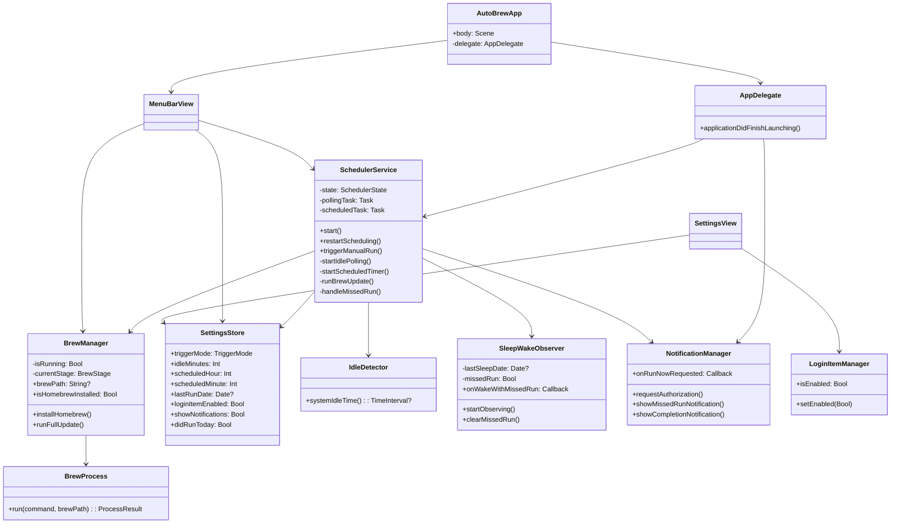
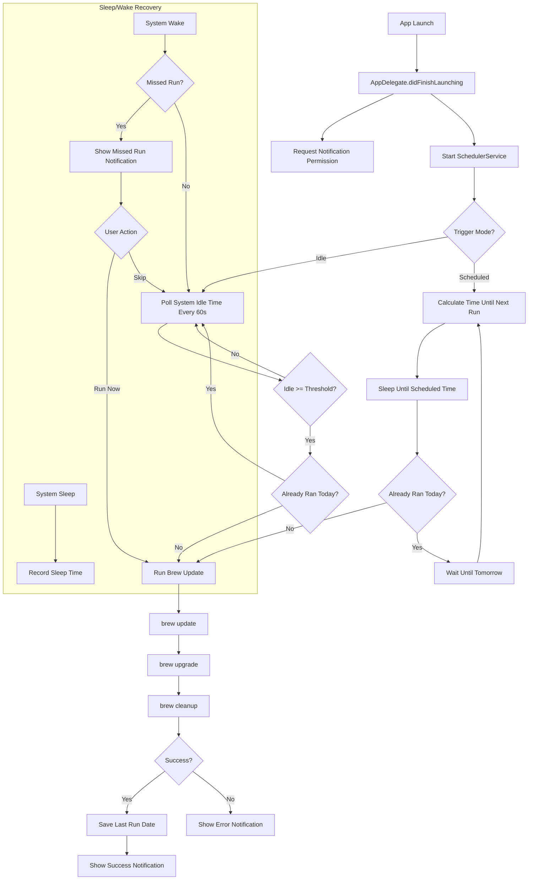
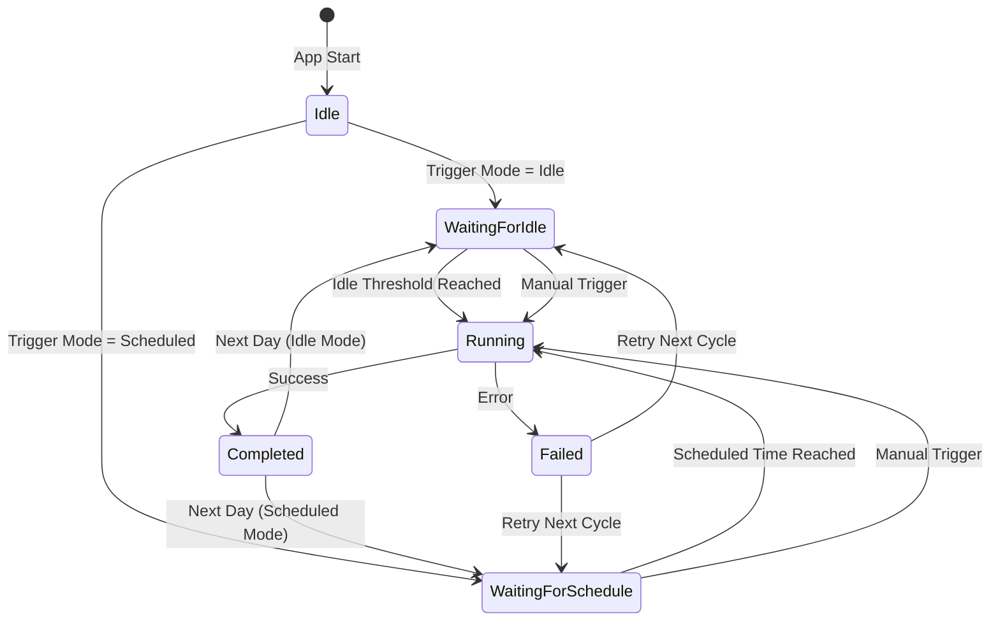

# AutoBrew

A native macOS menu bar app that automatically keeps Homebrew and all installed packages up to date — silently, in the background.

## Features

- **Automatic Updates** — Runs `brew update && brew upgrade && brew cleanup` once daily
- **Idle-Based Trigger** — Waits for configurable idle time before running (default: 30 min)
- **Scheduled Trigger** — Alternatively, run at a fixed time of day
- **Works While Locked** — Uses IOKit idle detection, independent of screen lock state
- **Missed Run Recovery** — If the Mac was asleep during a scheduled run, prompts the user on wake
- **Homebrew Auto-Install** — Installs Homebrew automatically if not present
- **Login Item** — Starts automatically with the system via SMAppService
- **Zero Dependencies** — Built entirely with Apple frameworks (SwiftUI, IOKit, UserNotifications, ServiceManagement)

## Requirements

- macOS 26.0+
- Xcode 26+
- Swift 6.0
- [XcodeGen](https://github.com/yonaskolb/XcodeGen)

## Setup

```bash
# Generate Xcode project
xcodegen generate

# Build
xcodebuild build -scheme AutoBrew -destination 'platform=macOS'

# Run tests
xcodebuild test -scheme AutoBrew -destination 'platform=macOS'
```

## Architecture

### Class Diagram



### Application Flow



### State Machine



## Project Structure

```
auto-brew/
├── project.yml                          # XcodeGen project definition
├── AutoBrew/
│   ├── Info.plist                       # App metadata (LSUIElement = true)
│   ├── AutoBrew.entitlements            # Sandbox + network
│   ├── Assets.xcassets                  # App icon
│   └── Localizable.xcstrings            # Localization (de/en)
├── Sources/
│   ├── App/
│   │   ├── AutoBrewApp.swift            # @main entry point with MenuBarExtra
│   │   └── AppDelegate.swift            # Lifecycle, activation policy
│   ├── Models/
│   │   ├── TriggerMode.swift            # .idle / .scheduled
│   │   ├── BrewStage.swift              # Update pipeline stages
│   │   ├── BrewError.swift              # Typed errors
│   │   ├── ProcessResult.swift          # Shell command result
│   │   └── SchedulerState.swift         # State machine states
│   ├── Services/
│   │   ├── BrewManager.swift            # Homebrew detection + execution
│   │   ├── BrewProcess.swift            # Process wrapper (async/await)
│   │   ├── SchedulerService.swift       # Central orchestrator
│   │   ├── IdleDetector.swift           # IOKit idle time
│   │   ├── SleepWakeObserver.swift      # NSWorkspace sleep/wake
│   │   ├── LoginItemManager.swift       # SMAppService wrapper
│   │   └── NotificationManager.swift    # UNUserNotificationCenter
│   ├── ViewModels/
│   │   └── SettingsStore.swift          # UserDefaults bridge
│   ├── Views/
│   │   ├── MenuBarView.swift            # Menu bar popover
│   │   └── SettingsView.swift           # Settings panel
│   └── Utilities/
│       └── AppLogger.swift              # Unified os.Logger
└── Tests/
    ├── BrewManagerTests.swift
    ├── IdleDetectorTests.swift
    └── SettingsStoreTests.swift
```

## Support

If you find AutoBrew useful, consider [sponsoring the project](https://github.com/sponsors/marcelrgberger).

## License

MIT License — see [LICENSE](LICENSE) for details.

Copyright 2026 Marcel R. G. Berger.
